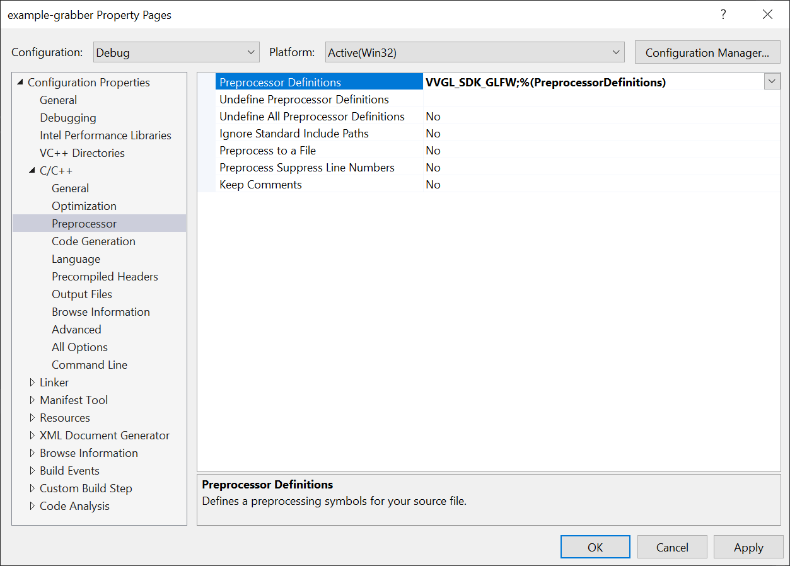
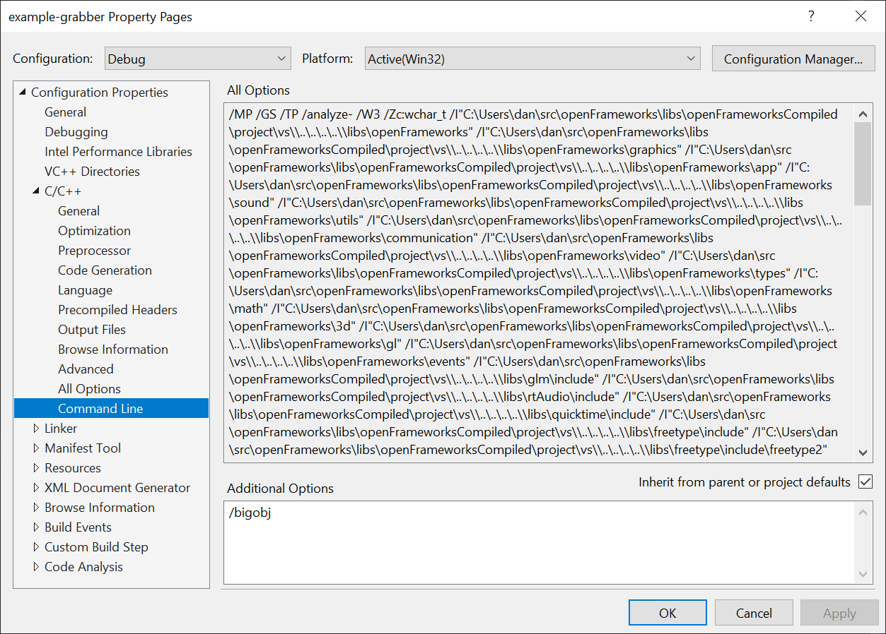
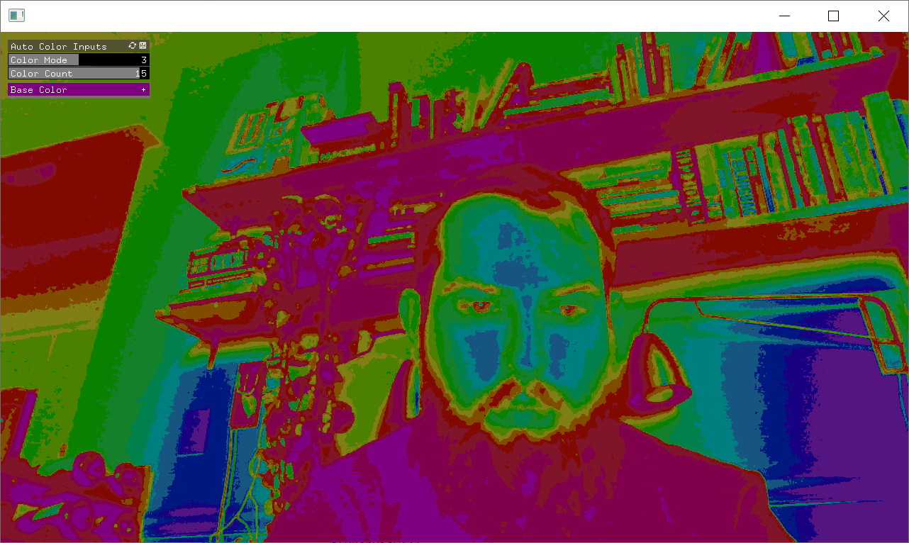
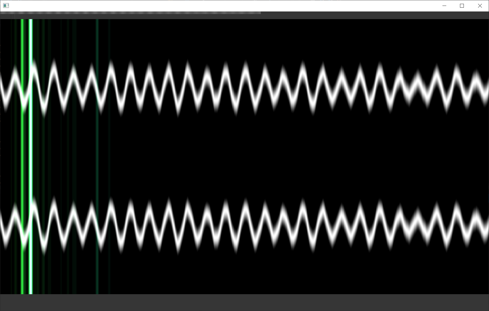
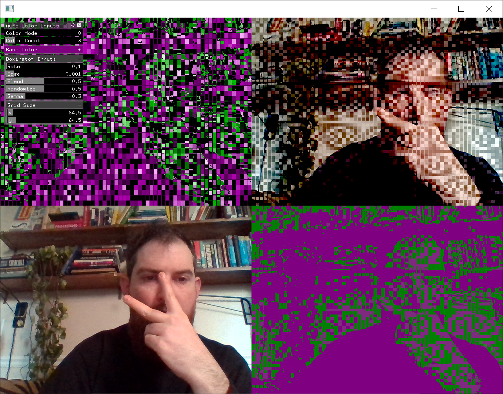
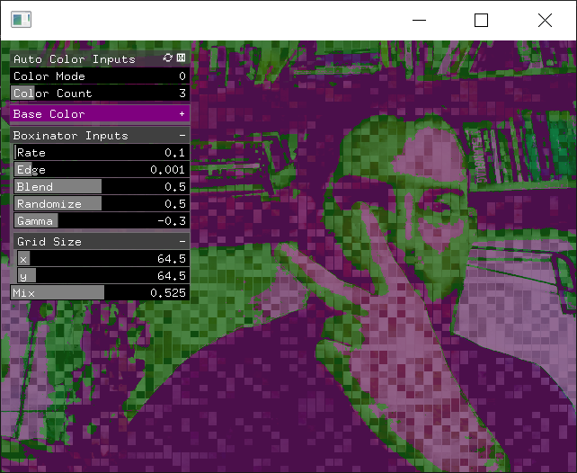
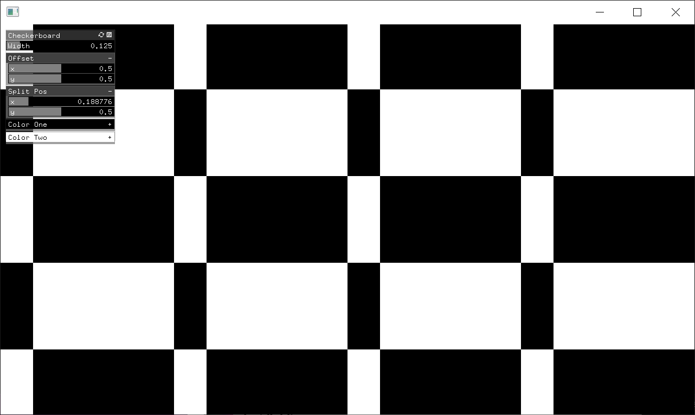
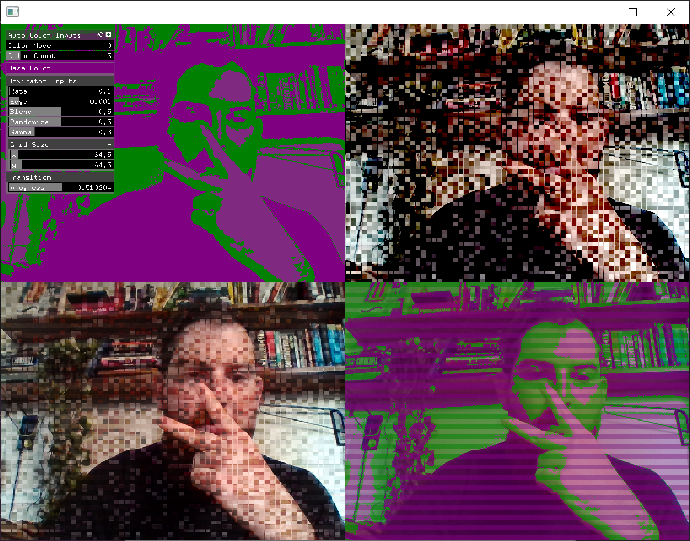

ofxVVISF
=====================================


Introduction
------------
This openFrameworks addon wraps the [VVISF-GL](https://github.com/mrRay/VVISF-GL) cpp library from [VIDVOX](http://vidvox.com).  It allows you to use [ISF files](https://github.com/vidvox/ISF-FILES) inside openFrameworks with a simple setup. 

### VVISF
ISF stands for "Interactive Shader Format", and is a file format that describes a GLSL fragment shader, as well as how to execute and interact with it (the official specification can be found here). VVISF is a cross-platform c++ library that implements the ISF protocol with support for a number of common SDKs (OS X, iOS, GLFW, and Qt) and GL environments (most versions of GL- both ES and desktop- are supported).

### VVGL
VVGL is a small library that performs rudimentary GL rendering, focusing mainly on texture generation/pooling and render-to-texture operations. Its primary purpose is to provide a simple consistent interface for performing these basic GL operations while obfuscating any platform-specific or environment-specific GL implementation details. VVISF is built on top of VVGL, but you don't need to be intimately familiar with VVGL to use VVISF.

License
-------
See [License](/license.md)

Installation
------------
 - clone the addon into the `openFrameworks/addons/` folder
 - setup the submodule by running 
    
    ```git submodule init``` 
    
    ```git submodule update```
 - Create a project with the project generator or create a projects by copying the examples
 - When creating a project you need to add preprocessor defines to enable the `VVGL_SDK_GLFW` flag.

 
 - Edit the command line options to add `/bigobj`
 
 - ESnjoy!
Examples
------------
### example-grabber

This example shows you how to use a ofVideoGrabber as a input source for an ISFScene.

### example-fft

This example shows you how to use audio as an input source for an ISFScene.  It uses [ofxFft](https://github.com/kylemcdonald/ofxFft) to generate the ```fftImage``` and the raw waveform to generate the ```waveImage```.  See the comments in the code to follow along.

### example-chain

This example shows you how to chain multiple ISFScenes together in a VFX chain.

### example-mixer

This example shows you how to simply mix between two ISFScenes

### example-generator

This example shows you how to use an ISFScene with a generator.

### example-transitions

This example shows you how to use multiple ISFScenes to feed a transition.

Compatibility
------------
tested with 0.10+ VS2017

Known issues
------------
Project generator might not work on macOS.  testers welcome! 

Version history
------------
0.0.1 initial release 


